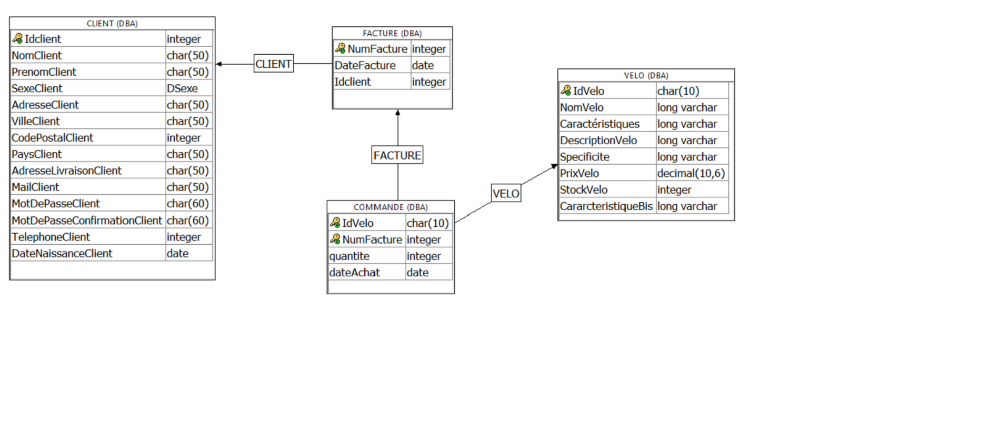

# projet e bike
Etudiant : KOUVAHE folly Serge

Classe : 1TM1

**Description du projet :**

 Mon projet a pour but :
 
 
•	L’achat de vélo électrique en ligne grâce à une page web sur laquelle on peut choisir le vélo désiré.

•	La connexion à son compte si on est déjà client ou la création d’un nouveau compte si ce n’est pas le cas ; tout cela via un formulaire

•	Une page qui génere la facture   reprenant les détails de la commande (le vélo et la quantité choisie. 

**Aspects implémentés :**

Backend : Une base de données permettant d’enregistrer les nouveaux clients, les commandes et de générer les factures.

Backend : Des webservices (avec les procédures associées) :
- Un webservice pour changer le mot de passe en cas d'oubli.
- Un webservice pour se connecter à son compte utilisateur.
- Un webservice qui vérifier si le client existe déjà dans la base de données.
- Un webservice pour l'insertion d'un nouveau client.
- Un webservice pour l'insertion d'une commande.
- Un webservice pour l'insertion d'une facture.
- Un webservice pour le chargement des données du vélo depuis la base de données.
- Un webservice pour selectionner le nom et le prix d'un vélo.
- Un webservice pour le chargement du numéro de la facture.
- Un webservice pour voir la liste des  vélos vendus par spécificité à une date donnée.
- Un webservice pour vérifier le stock existant afin de s'assurer que la commande peut être passée.
- Un webservice pour vérifier si l'email du client existe déjà.
- Un webservice pour la mise à jour du stock après le payement.

frontend : Une page web (html, js, css) permettant d'appeler les webservices et de traiter les réponses, qui propose une interface utilisateur pour:

-Ajouter l'article et la quantité via une page

-connexion à son compte 

-création d’un compte client 

-La navigation entre les différentes pages du site (Accueil, Vélo, Compte, Statistique...)

**Détail api rest:**

CREATE SERVICE "http_getChangePassword" TYPE 'JSON' AUTHORIZATION OFF USER "DBA" URL ON METHODS 'GET' AS call getChangePassword(:idClient,:password1,:password2);

CREATE SERVICE "http_getConnexion" TYPE 'JSON' AUTHORIZATION OFF USER "DBA" URL ON METHODS 'GET' AS call getConnexion(:mail,:paswoord);

CREATE SERVICE "http_getIdClient" TYPE 'RAW' AUTHORIZATION OFF USER "DBA" METHODS 'GET' AS call getIdClt(:nomClt,:prenomClt,:dateNaisClt,:mail);

CREATE SERVICE "http_getInsertClient" TYPE 'RAW' AUTHORIZATION OFF USER "DBA" URL ON METHODS 'GET' AS call getInsertionClient(:nom,
:prenom,
:sexe,
:adresse,
:ville,
:codePostal,
:pays,
:adresseLivraison,
:email,
:motPasse,
:confirmationMotPasse,
:telephone,
:dateNaissance);

CREATE SERVICE "http_getInsertCommande" TYPE 'RAW' AUTHORIZATION OFF USER "DBA" URL ON METHODS 'GET' AS call getInsertCommande(:veloId,:FactNum,:dateCmde,:qte);
-- 
--
--

CREATE SERVICE "http_getInsertFacture" TYPE 'RAW' AUTHORIZATION OFF USER "DBA" URL ON METHODS 'GET' AS call getInsertFacture(:factDate,:cltId);
--
--
-- 

CREATE SERVICE "http_getLoadVTT_Serious" TYPE 'JSON' AUTHORIZATION OFF USER "DBA" URL ON METHODS 'GET' AS call getLoadVTT_Serious();
--
--
--

CREATE SERVICE "http_getNom_Prix" TYPE 'JSON' AUTHORIZATION OFF USER "DBA" URL ON METHODS 'GET' AS call getNom_Prix(:refVelo);
--
--
--

CREATE SERVICE "http_getNumFacture" TYPE 'JSON' AUTHORIZATION OFF USER "DBA" URL ON METHODS 'GET' AS call getNumFacture();
--
--
--

CREATE SERVICE "http_getStatistique" TYPE 'JSON' AUTHORIZATION OFF USER "DBA" URL ON METHODS 'GET' AS call getStatistique(:specificite,:date1,:date2);
--
--
--

CREATE SERVICE "http_getStock" TYPE 'JSON' AUTHORIZATION OFF USER "DBA" URL ON METHODS 'GET' AS call getStock(:prodId);
--
--
--

CREATE SERVICE "http_getTestEmail" TYPE 'JSON' AUTHORIZATION OFF USER "DBA" URL ON METHODS 'GET' AS call getTestEmail(:email);
-- Permet le select  
-- Paramètre reçu pour la requête: l'e mail 
-- Le réponse de la procédure renvoie un type JSON  --

CREATE SERVICE "http_getUpdateStock" TYPE 'JSON' AUTHORIZATION OFF USER "DBA" URL ON METHODS 'GET' AS call getUpdateStock(:refprod,:nvoStock);
-- Permet de mettre à jour la quantité  restante dans la table vélo  --\
-- Paramètre reçu pour la requête: veloId et Nouveau Sotck après calcul --\
-- Le réponse de la procédure renvoie un type JSON  --

**Détails de la DB(Diagramme, Tables et champs)**

**Création des tables**

/* Table facture enregistre les factures*/

CREATE TABLE FACTURE(
NumFacture INTEGER NOT NULL DEFAULT AUTOINCREMENT  PRIMARY KEY, //Identifiant de la table; autoincrémentée

DateFacture DATE, //Date d'émission de la facture

Idclient INTEGER, // Clée étrangère venant de la table Client

FOREIGN  KEY (Idclient) REFERENCES  CLIENT
                        ON  DELETE SET NULL  

)

/* table client: Enregistre les nouveaux clients*/

CREATE TABLE CLIENT(
Idclient INTEGER NOT NULL DEFAULT  AUTOINCREMENT PRIMARY KEY, //Identifiant de la table; autoincrémentée

NomClient CHAR(50)NOT NULL, //Nom du client

PrenomClient CHAR(50)NOT NULL,//Prénom du client

SexeClient DSexe, // Sexe du client

AdresseClient CHAR(50)NOT NULL, //Adresse du client

VilleClient CHAR(30)NOT NULL, //Ville du client

CodePostalClient INTEGER NOT NULL , //Code postal du client

PaysClient CHAR(50) NOT NULL, //Pays du client

AdresseLivraisonClient CHAR(50), //Adresse du client

MailClient CHAR(50)NOT NULL, //Mail du client

MotDePasseClient CHAR(60), //Mot de passe du client

MotDePasseConfirmationClient CHAR(60), //Confirmation du mot de passe du client

TelephoneClient INTEGER, //Téléphone du client

DateNaissanceClient DATE, //Date naissance du client

)

/*table vélo*/

CREATE TABLE VELO(

IdVelo CHAR(10) PRIMARY KEY, //Identifiant de la table

NomVelo CHAR(50), //Nom du vélo

Caractéristiques1 LONG VARCHAR, // Caracteristique

DescriptionVelo LONG VARCHAR, //Description

Specificite LONG VARCHAR, //Spécificité

PrixVelo DECIMAL, //Prix

StockVelo INTEGER NOT NULL, //Stock

Caractéristiques1 LONG VARCHAR, // Caracteristique

)

CREATE TABLE COMMANDE(

IdVelo CHAR (10), //Identifiant de la table venant de la table Velo

NumFacture INTEGER, //Identifiant de la table venant de la table Facture

quantite INTEGER, //Quantité achetée

dateAchat DATE, //Date d'achat

PRIMARY KEY (IdVelo,NumFacture), 

FOREIGN KEY (IdVelo) REFERENCES  VELO (IdVelo),
FOREIGN KEY (NumFacture) REFERENCES  FACTURE(NumFacture)

)
